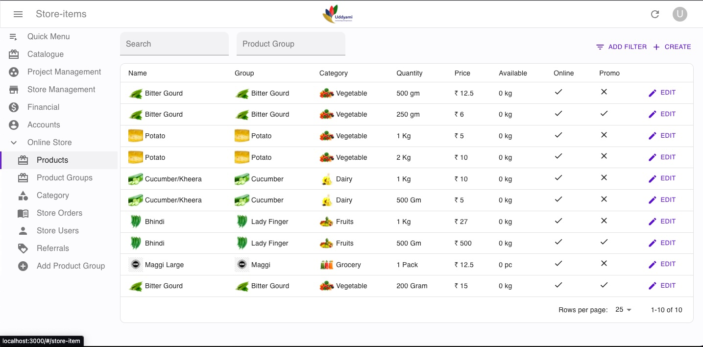
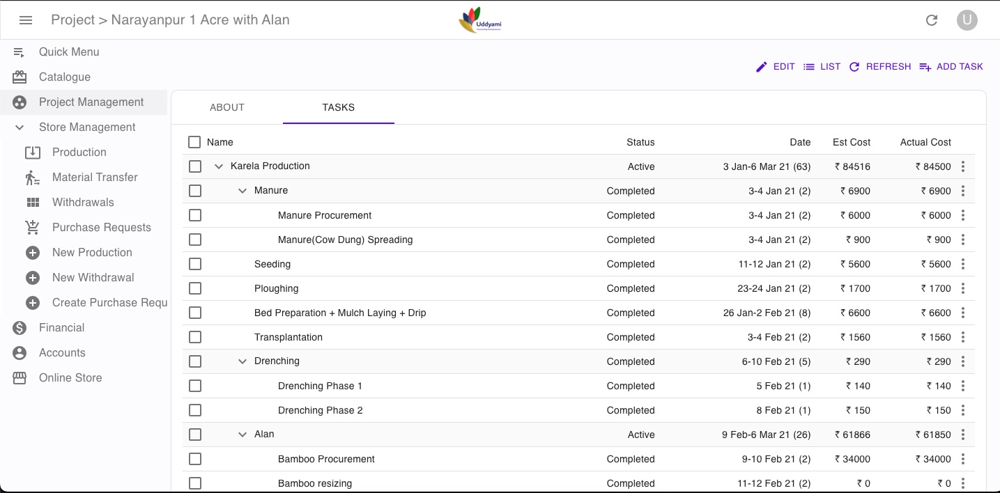
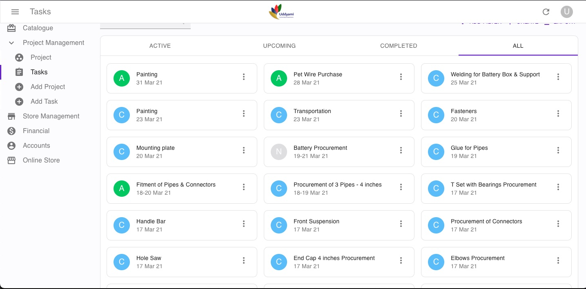

# Uddyami - Agricultural & Business Portal

Uddyami is a one-stop platform for agricultural and business services. The platform connects farmers, entrepreneurs, and service providers across various sectors including food processing, dairy, fisheries and more.

## Features

- **Farm Management**: Crop planning, farm management tools, sensor data
- **Store Management**: Sale items, product listings
- **User Management**: Member registration, authentication system

## Screenshots

### Homepage Dashboard

*The main dashboard showcasing various business categories including food processing, agriculture, dairy, textiles, and professional services.*

### Service Categories

*Detailed view of different service categories available on the platform, including food, beverages, fisheries, and business services.*

### Platform Interface

*User interface showing the comprehensive portal layout with navigation and service offerings.*

